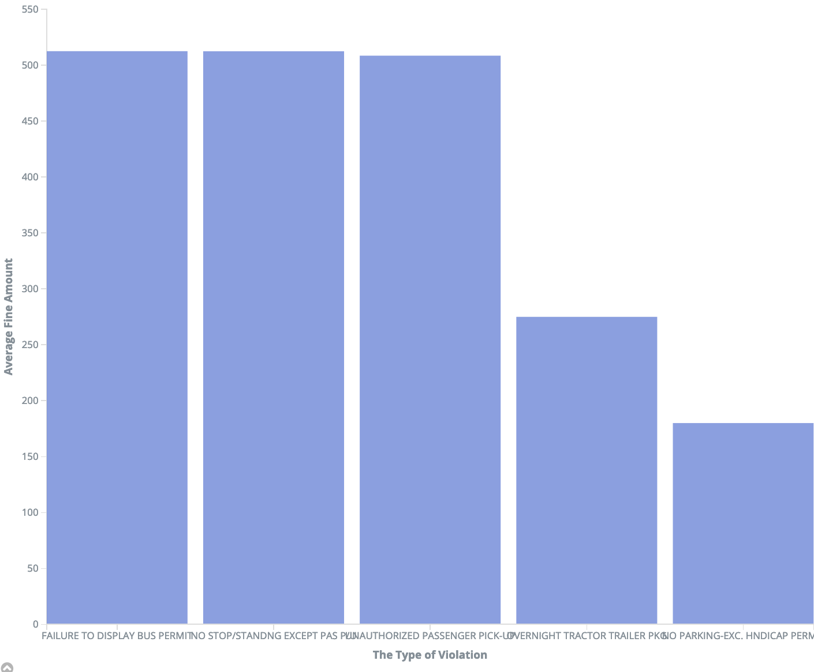

# Analyzing Millions of NYC Parking Violations

For this analysis, 100,000 rows of dataset is loaded into kibana API on top of elasticsearch API. Parking violations in the past 5-year are used, which is 92,871 out of 100,000. The exact date is from March 18th, 2015 to March 18th, 2020.

Detailed analysis is as below.

## Analysis 1 - Top 5 Types of Violations

- School zone speeding is over 31 percentage of total parking violations.
- No parking during street cleaning is almost 29 percentage. 
- Both are over 60 percentage of total violations

## Analysis 2 - Violation Trend in past 5 years

- More parking violations are occured in 2016 and 2019 than other years.

## Analysis 3 - The Number of Violations by County

- Manhattan has the most parking violations. In Manhattan, no standing day/time limits are the most violated(over 30 percentage).
- Brooklyn has the least in NYC. Interestingly, 75 percentage of parking violations in Brooklyn is school zone speeding.

## Analysis 4 - Average Fine Amount by Type of Violations

- Three types of violation has more than 500 dollar of fine: Failure to display bus permit, No stop/standing, Unauthorized passenger pick-up.
- Other types of violations are fined less than 300 dollars

## Analysis 5 - Average Reduction Amount by Type of Violations

- Surprisingly, Top 3 fine amount violation types are Top 3 reduction in fine amount: Failure to display bus permit, No stop/standing, Unauthorized passenger pick-up.
- Those three types of violations have unfair fine amount compared with other types.